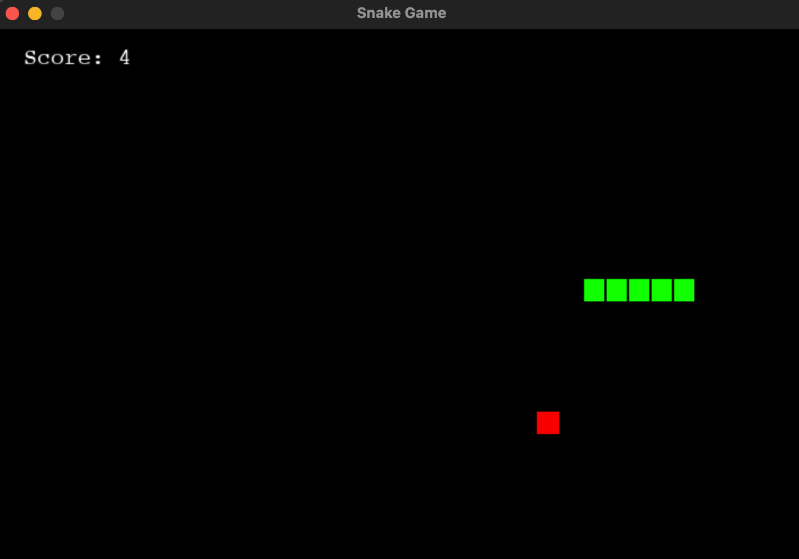
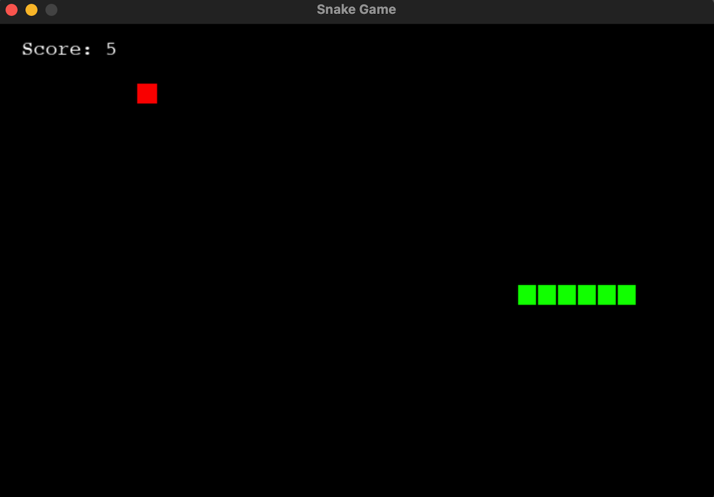
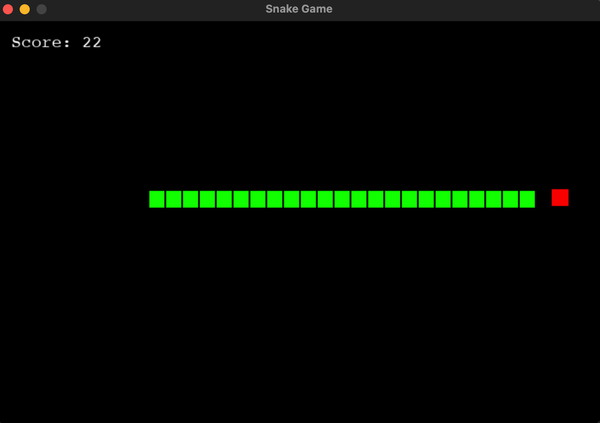
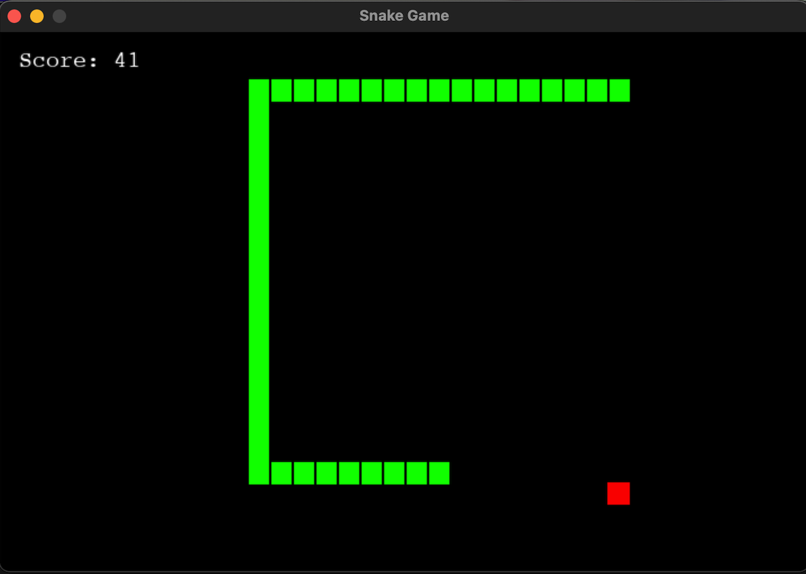

# Snake-Game

## Features
- Classic snake game mechanics with grid-based movement.
- Game-over detection when the snake collides with itself.
- Food spawns at random positions on the screen.
- The snake wraps around screen edges for continuous play.
- Displays the current score during gameplay.

## Technologies Used
- Programming language: Python
- Library: Python

## Project Structure
.
└── snake/
    ├── snake.py          # Main game script
    └── README.md         # Project documentation

## How to Run the Project
1. Clone the Repository
Download the project files to your local machine:
    git clone https://github.com/vmdj7/Snake-Game
    cd snake

2. Set Up the Environment
Ensure you have Python and Pygame installed:
    python --version
    pip install pygame

3. Run the Game
Execute the following command:
    python3 snake.py

## How to Play
-Navigate the snake using arrow keys or W/A/S/D.
-Collect food (red squares) to grow the snake and increase your score.
-Avoid colliding with yourself to keep playing.
-The snake wraps around screen edges, so use this to your advantage!

## Screenshots

## Author
Created by [Victor De Jesus](https://github.com/vmdj7)

   

   
